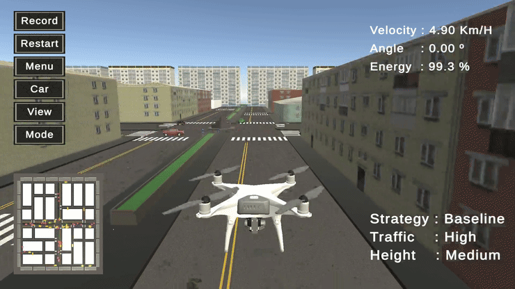
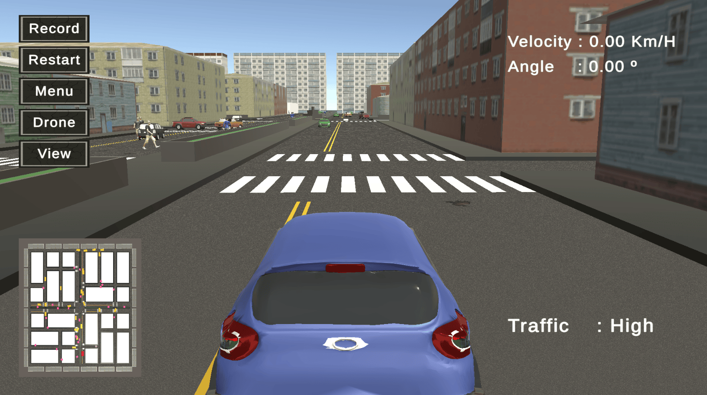
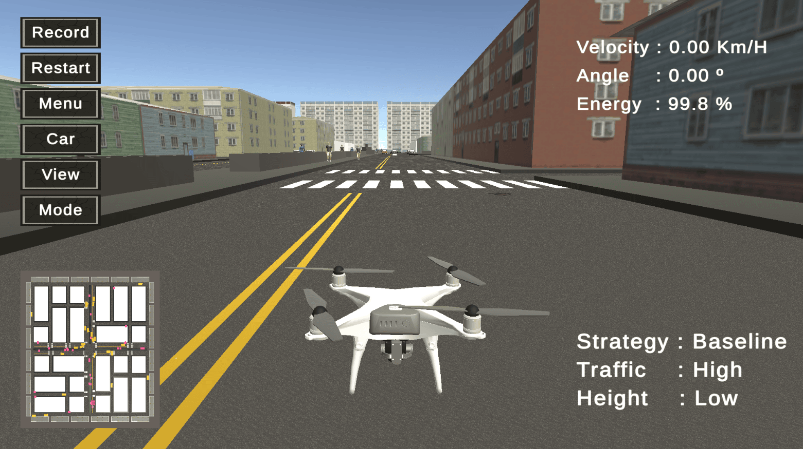
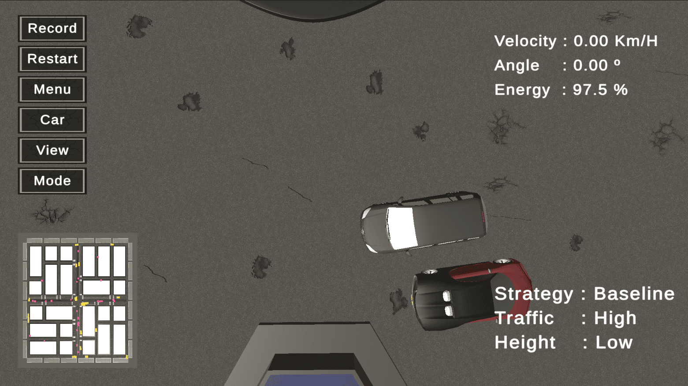
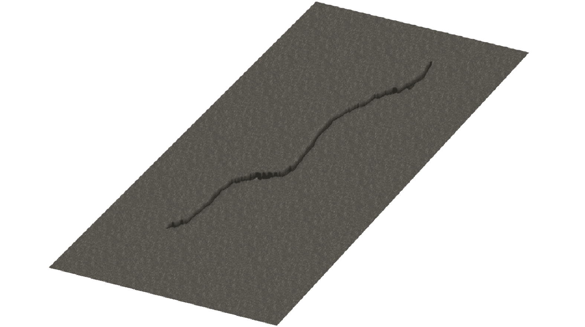
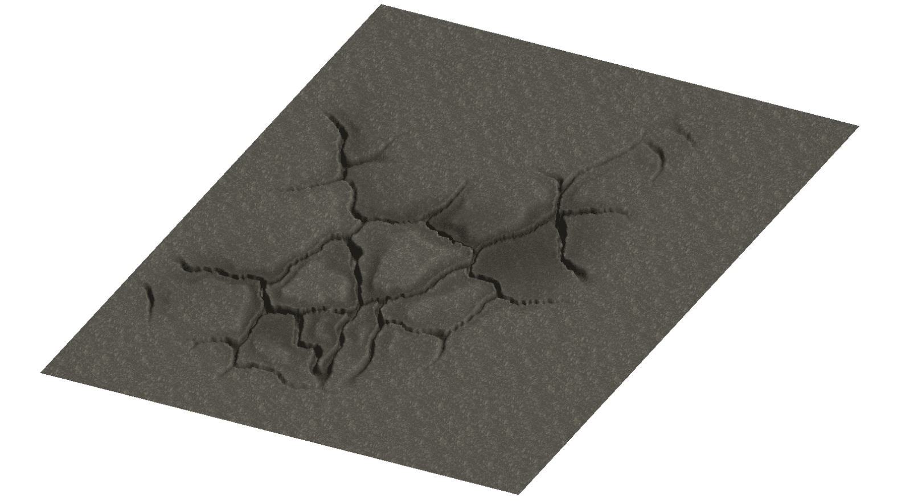
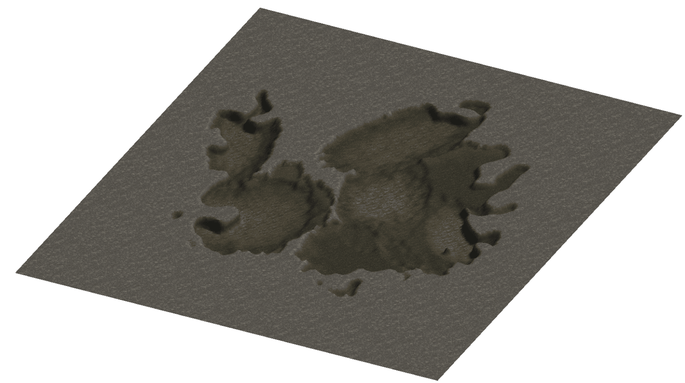
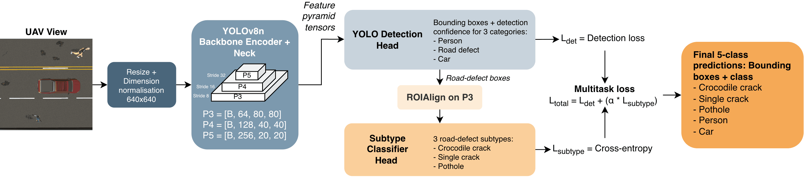

<p>
  <h1>
    A Digital Twin Framework for Traffic-Aware UAV Pavement Monitoring in Open-Traffic Conditions 🛣️ 
  </h1>
</p>

[Yamil Uchani](https://www.linkedin.com/in/yamiluchani/), [Grace Luna](https://www.linkedin.com/in/grace-luna-verdueta/), [Edwin Salcedo](https://www.linkedin.com/in/edwinsalcedo/), and [Mauricio Figueroa](https://www.linkedin.com/in/mau-figue/)

[](https://arxiv.org/abs/2606.20742)
[](unity/)
[](models/model_finetuned.pt)
[](https://drive.google.com/drive/folders/1bfLm6uia9jM-xPxxl2PxLrq3OVG0Z8TZ?usp=sharing)

<p align="center">
  
</p>

## Menu

1. [Introduction](#1-introduction)
2. [Quick Start](#2-quick-start)
3. [Data](#3-data)
4. [Perception Model](#4-perception-model)
5. [Recovery Strategy Experiments](#5-recovery-strategy-experiments)
6. [Test Automator](#6-test-automator)
7. [System Hardware Requirements](#7-system-hardware-requirements)
8. [Repository Structure](#8-repository-structure)
9. [Citation](#9-citation)

## 1. Introduction

This repository contains the Unity digital twin simulator, trained perception models, and Python inference server for traffic-aware UAV pavement monitoring in open-traffic conditions. It provides a controlled environment for studying how autonomous UAV inspection behaves when dynamic vehicles, pedestrians, and temporary occlusions affect road-surface visibility.

The framework integrates:

- a Unity urban-road environment with dynamic vehicles and pedestrians;
- procedurally generated road defects, including Single Crack, Crocodile Crack, and Pothole;
- autonomous UAV navigation over road segments using Unity NavMesh;
- adaptive recovery strategies for occluded inspection regions;
- a multitask YOLOv8n perception model for road defects, pedestrians, and vehicles;
- a batch experiment automator for repeatable UAV recovery-strategy evaluation.

## 2. Quick Start

### Option A: Docker Web Simulator (Recommended - 1-Click / Command)

Run the full Digital Twin 3D simulator and YOLOv8 perception backend inside Docker containers with zero manual Python environment setup:

#### 🪟 Windows Setup & Execution
1. **Prerequisites:** Install [Docker Desktop for Windows](https://www.docker.com/products/docker-desktop/) with WSL2 backend enabled.
2. **Start Services:** Run `docker compose up -d` in terminal (or double-click `start_windows.bat`).
3. **Open Simulator:** Open your web browser and navigate to:  
   👉 **`http://localhost/`**  
   *(Verified and compatible with Google Chrome, Microsoft Edge, and Mozilla Firefox).*
4. **AI Detections Output:** Processed images with bounding boxes and defect labels are automatically saved on your host computer in:  
   📁 `./detections_output/`  
   *(or accessible via browser at `http://localhost/api/detections/<image_name>.jpg`).*
5. **Stop Services:** Run `docker compose down` (or double-click `stop_windows.bat`).

#### 🐧 Linux Setup & Execution (Ubuntu / Linux Mint / Debian)
1. **Prerequisites:** Install Docker and the Docker Compose plugin (`sudo apt install docker-compose-plugin`).
2. **GPU Acceleration (Optional):** Install [NVIDIA Container Toolkit](https://docs.nvidia.com/datacenter/cloud-native/container-toolkit/latest/install-guide.html) for fast GPU inference (~10–15 ms per frame).
3. **Start Services:** Run:
   ```bash
   docker compose up -d
   ```
4. **Open Simulator (Browser Recommendation):**  
   - On Linux systems (especially laptops with hybrid Intel/NVIDIA graphics), **Mozilla Firefox** launched with dedicated GPU provides the smoothest WebGL 2.0 3D hardware-accelerated rendering.
   - **Launch with GPU:** Right-click the Firefox icon and select *"Run with Dedicated Graphics Card"*, or run via terminal:
     ```bash
     MOZ_ENABLE_WAYLAND=0 __NV_PRIME_RENDER_OFFLOAD=1 __GLX_VENDOR_LIBRARY_NAME=nvidia firefox http://localhost &
     ```
5. **AI Detections Output:** Annotated captures are automatically saved on your host machine in:  
   📁 `./detections_output/`
6. **Stop Services:** Run `docker compose down`.

---

### Option B: Native Unity Editor & Python Server

#### 1. Open the Unity project

The Unity project root is: `unity/`. Open that folder in Unity Hub. The project was last configured with: `Unity 6000.2.14f1`.

The main scenes are registered in `unity/ProjectSettings/EditorBuildSettings.asset`.

| Scene | Purpose |
| --- | --- |
| `Assets/Scenes/Mode_Menu.unity` | Entry scene for launching simulator modes. |
| `Assets/Scenes/Mode_Load.unity` | Loading and initialisation scene. |
| `Assets/Scenes/Mode_Model.unity` | Interactive visual simulation. |
| `Assets/Scenes/Mode_Data.unity` | Batch experiment and data mode. |
| `Assets/Scenes/Mode_Capture.unity` | Dataset capture mode. |

#### 2. Create the Python environment

From the repository root:

```bash
python3 -m venv .venv
source .venv/bin/activate
python -m pip install --upgrade pip
python -m pip install -r requirements.txt
```

#### 3. Start the model server

The deployed checkpoint is: `models/model_finetuned.pt`. Start the server from the repository root:

```bash
source .venv/bin/activate
python unity/Assets/Scripts/IA/api_model_pt.py
```

Then, the server should allow inference at: `http://127.0.0.1:5000`. For a health check, use:
```bash
curl http://127.0.0.1:5000/health
```

Prediction test:
```bash
curl -X POST \
  -F "file=@/absolute/path/to/test_image.png" \
  http://127.0.0.1:5000/predict
```

Example response:

```json
[
  {
    "clase": "Pothole",
    "det_conf": 0.91,
    "cls_conf": 0.88,
    "caja": [120, 95, 260, 180]
  }
]
```

Annotated server outputs are written to:

```text
unity/Assets/Scripts/IA/Detecciones_model_pt/
```

#### 4. Run the simulator

1. Start the Python server.
2. Open `unity/` in Unity Hub.
3. Open `Assets/Scenes/Mode_Menu.unity`.
4. Press Play.
5. Select the desired simulator mode from the menu.

## 3. Data

The datasets described in the paper are available on [Google Drive](https://drive.google.com/drive/folders/1bfLm6uia9jM-xPxxl2PxLrq3OVG0Z8TZ?usp=sharing) and follow the structure below:

| Folder | Paper name | Purpose | Local files |
| --- | --- | --- | --- |
| `merged_dataset` | Merged Dataset | Normalised five-class dataset assembled from the source road-damage and UAV traffic datasets before balancing. | 18,227 images, including 17,424 annotated images and 803 backgrounds; 71,034 boxes. |
| `balanced_dataset` | Balanced Dataset | Class-balanced and augmented real-image dataset used for the first model-development stage. | 46,175 images, including 42,755 annotated images and 3,420 backgrounds; 120,769 boxes. |
| `synthetic_dataset` | Synthetic Dataset | Unity-captured target-domain dataset used for simulator-domain fine-tuning and evaluation. | 2,235 images, including 2,235 annotated images and 0 backgrounds; 25,943 boxes. |

Furthermore, the Unity digital twin generates UAV-view road scenes with:

<p align="center">
  
  
  
</p>

- road-surface defects: `Single Crack`, `Crocodile Crack`, and `Pothole`;
- traffic agents: `Person` and `Car`;
- configurable traffic densities and UAV altitudes;
- road-segment inspection targets selected manually or by the experiment automator.

<p align="center">
  
  
  
</p>

## 4. Perception Model

The deployed model is a multitask YOLOv8n model. It performs coarse detection first and then classifies road-defect subtypes from ROI-aligned features. The notebook `notebooks/multimodal_uav_detector.ipynb` includes the detector implementation, dataset checks, checkpoint loading, model evaluation switch, and synthetic fine-tuning switch. The exported checkpoints are stored under `models/`.

<p align="center">
  
</p>

The model maps classes as follows:

| ID | Class |
| ---: | --- |
| 0 | `Crocodile Crack` |
| 1 | `Single Crack` |
| 2 | `Pothole` |
| 3 | `Person` |
| 4 | `Car` |

## 5. Recovery Strategy Experiments

The digital twin evaluates UAV inspection behaviour under occlusion. At each time step, it tracks the road segments, dynamic traffic agents, UAV state, inspection memory, and available recovery policies. When the target road segment becomes insufficiently visible, the simulator can trigger a recovery strategy.

| ID | Strategy | Action |
| ---: | --- | --- |
| 1 | `Baseline` | Follow the planned inspection route without an explicit recovery action. |
| 2 | `Hover` | Wait briefly over the target segment so temporary occlusions can clear. |
| 3 | `Micro` | Apply a small local repositioning movement to improve visibility. |
| 4 | `Skip` | Skip the occluded segment and revisit it later in the mission. |

The experiment protocol combines:

| Factor | Levels |
| --- | --- |
| Traffic density | `Low`, `Medium`, `High` |
| UAV altitude | `Low = 6 m`, `Medium = 10 m`, `High = 15 m` |
| Recovery strategy | `Baseline`, `Hover`, `Micro`, `Skip` |

The full batch covers:

```text
3 traffic levels x 3 altitude levels x 4 strategies = 36 episodes
```

### Reported Metrics

The paper-style recovery tables report the mean value over the 20 inspected segments in each traffic-altitude-strategy configuration.

| Metric | Meaning | Segment-level calculation |
| --- | --- | --- |
| `Coverage (%)` | Percentage of real road defects detected by the perception model. Recovered detections found during a revisit are added to the final detected count, capped at 100%. | `detectedByModel / detectedByRaycast * 100`, with new recovered detections included when applicable. |
| `Recovery Coverage (%)` / `Recovery (%)` | Percentage of additional defects found during the second pass. This applies to `Skip`; strategies without a revisit report `0%`. | `recoveredInSecondPass / detectedByRaycast * 100`, counting only defects found in the revisit that were not detected earlier. |
| `Time (s)` | Time required to complete an inspected segment. | `Time.time - segmentStartTime`. |
| `Energy (%)` | UAV battery energy consumed during an inspected segment. | `segmentStartEnergy - currentEnergy`. |

> **Note 💡:** We found that flight altitude has a clear effect on inspection coverage, but there is no single best recovery strategy for every setting. In the reported experiments, Baseline often worked well at medium and high altitude, Hover helped in some busier traffic cases but could make missions longer, Micro was most useful in a few low-altitude cases, and Skip added revisit behaviour with extra time and energy cost.

The processed recovery-strategy results are available as CSV files in the tracked `results/` folder:

| File | Purpose |
| --- | --- |
| `results/uav_segment_results.csv` | Detailed per-segment export with 720 rows: 36 experiment configurations x 20 segment-level entries. Use for per-segment analysis. |
| `results/uav_summary_results.csv` | Compact summary table with one row per traffic-altitude-strategy configuration. Use this to reproduce paper-style coverage, recovery, energy, and mission-time tables. |

### Recorded Experiment Videos

Selected high-traffic, high-altitude episodes are included under `assets/videos/recorded_experiments/`. Camera 1 shows the backview pointing towards the UAV, while Camera 2 shows the topview from the UAV. The file `assets/videos/recorded_experiments/recorded_experiments.csv` keeps the same information in machine-readable form.

| Episode | Strategy | Traffic | Height | Camera 1 | Camera 2 | Description |
| ---: | --- | --- | --- | --- | --- | --- |
| 33 | `Baseline` | `High` | `High` | [Backview](assets/videos/recorded_experiments/episode_33_cam1.mp4) | [UAV topview](assets/videos/recorded_experiments/episode_33_cam2.mp4) | Reference run without an explicit recovery action. |
| 34 | `Hover` | `High` | `High` | [Backview](assets/videos/recorded_experiments/episode_34_cam1.mp4) | [UAV topview](assets/videos/recorded_experiments/episode_34_cam2.mp4) | Hover-and-recheck run where the UAV waits briefly over an occluded segment before continuing. |
| 35 | `Micro` | `High` | `High` | [Backview](assets/videos/recorded_experiments/episode_35_cam1.mp4) | [UAV topview](assets/videos/recorded_experiments/episode_35_cam2.mp4) | Local repositioning run used to inspect how small UAV movements affect visibility under heavy traffic. |
| 36 | `Skip` | `High` | `High` | [Backview](assets/videos/recorded_experiments/episode_36_cam1.mp4) | [UAV topview](assets/videos/recorded_experiments/episode_36_cam2.mp4) | Revisit-based run showing the skipped-segment behaviour and its extra mission cost. |

## 6. Test Automator

The batch experiment automator is attached to the `DigitalTwinManager` object in:

```text
unity/Assets/Scenes/Mode_Data.unity
```

Recommended workflow:

1. Open `Assets/Scenes/Mode_Data.unity`.
2. Select the inactive `DigitalTwinManager` object in the Hierarchy.
3. Find the `DigitalTwin.ExperimentAutomator` component in the Inspector.
4. Configure the experiment fields.
5. Press Play.
6. From the component context menu, run `Start Experiment Batch`.

Useful automator fields:

| Field | Recommended value |
| --- | --- |
| `segmentsPerEpisode` | Use `1` for a smoke test or `20` for the full protocol. |
| `startFromEpisode` | Use `0` to start from the beginning. |
| `initialTrafficLevel` | `0=Low`, `1=Medium`, `2=High`. |
| `initialAltitudeLevel` | `0=Low`, `1=Medium`, `2=High`. |
| `initialNavigationMode` | `1=Baseline`, `2=Hover`, `3=Micro`, `4=Skip`. |
| `recordingMode` | Disabled for the full 36-episode sweep; enabled for selected recording runs. |

The automator disables `PythonInferenceClient` during controlled batch execution so recovery-strategy comparisons remain deterministic and memory-efficient. Use the Python server for model-assisted interactive runs and dataset capture workflows.

Batch outputs are written under:

```text
unity/Assets/DigitalTwin_Logs/
```

Important files:

| File | Contents |
| --- | --- |
| `Progress_Results.csv` | Progress rows written while the batch runs. |
| `All_Streets_Results.csv` | Full experiment summary. |
| `Paper_Table_Results.csv` | Compact coverage, time, energy, and recovery table. |
| `Ep*_Seg*_*.csv` | Per-segment details. |
| `Episode_*_*.csv` | Per-episode segment details. |

## 7. System Hardware Requirements

### Windows desktop simulator (`simulator/`)

- Windows 10 or 11 (64-bit).
- A desktop or laptop capable of running a Unity 3D project with dynamic agents and NavMesh navigation.
- A discrete GPU is recommended for smoother interactive runs.
- **Microsoft Visual C++ 2015–2022 Redistributable (x64)** must be installed.  
  Download it from the [official Microsoft page](https://learn.microsoft.com/en-us/cpp/windows/latest-supported-vc-redist).  
  This is the redistributable package used by Unity `6000.2.14f1`, which this project is built with.

### Web simulator (`web/simulator-web/`)

> **Note:** The web build runs entirely inside your browser — no installation is required. However, it still uses the **processing power of your own computer** (CPU and GPU). Performance will depend on your hardware, and weaker machines may experience lower frame rates.

- Any modern desktop browser with **WebAssembly** and **WebGL 2** support (Chrome, Edge, or Firefox recommended).
- A mid-range or better GPU is recommended for acceptable frame rates.
- At least **4 GB of RAM** available for the browser tab.
- To run it locally from the repository, start a static file server:

  Windows:
  ```bat
  web\simulator-web\start_server.bat
  ```

  macOS/Linux:
  ```bash
  cd web/simulator-web
  python3 -m http.server 8766 --bind 127.0.0.1
  ```

  Then open `http://127.0.0.1:8766` in your browser.

### Python inference server

- Python 3.10 or newer.
- PyTorch, TorchVision, Ultralytics, FastAPI, Uvicorn, OpenCV, and NumPy.
- CUDA is recommended for real-time inference, but CPU execution can be used for debugging.

The experiments reported in the paper were run on a desktop with an AMD Ryzen 5 5600G CPU, NVIDIA GeForce GTX 1050 Ti GPU with 4 GB VRAM, and 16 GB RAM. Detector FPS comparisons were measured on an NVIDIA T4 GPU.

## 8. Repository Structure

```text
RDMO-DigitalTwin/
|-- LICENSE.md
|-- README.md
|-- requirements.txt
|-- assets/
|   |-- gifs/                    # README animations of the project
|   |-- images/                  # Figures and visual examples
|   `-- videos/
|       |-- recorded_experiments/ # Experiment recordings and CSV manifest
|       |-- uav_view_back.mp4
|       `-- uav_view_topview.mp4
|-- docs/
|   |-- DEPLOYMENT.md           # Unity + Python server deployment guide
|   |-- LOG.md                  # Project experiment log
|   `-- MODEL_CARD.md           # Model architecture, metrics, and limitations
|-- models/
|   |-- model_base.pt            # Baseline checkpoint
|   `-- model_finetuned.pt       # Deployed checkpoint
|-- notebooks/
|   `-- multimodal_uav_detector.ipynb # Multitask detector notebook
|-- results/
|   |-- uav_segment_results.csv  # Per-segment UAV recovery-strategy results
|   `-- uav_summary_results.csv  # Aggregated recovery-strategy summaries
|-- simulator/
|   |-- PotholeDetector.exe      # Windows desktop simulator build
|   `-- PotholeDetector_Data/    # Unity runtime data for the desktop build
|-- unity/
|   |-- Assets/
|   |-- Packages/
|   `-- ProjectSettings/
`-- web/
    |-- media/                   # Web copies of project images and videos
    |-- paper-web/               # Academic project page
    |-- project-web/             # RDMO project overview site
    `-- simulator-web/           # Unity WebGL simulator build
```

## 9. Citation

If you find this project useful, please cite the associated paper:

```bibtex
@misc{uchani2026digitaltwinopentraffic,
  title         = {A Digital Twin Framework for Traffic-Aware UAV Pavement Monitoring in Open-Traffic Conditions},
  author        = {Uchani, Yamil and Luna, Grace and Salcedo, Edwin and Figueroa, Mauricio},
  year          = {2026},
  eprint        = {2606.20742},
  archivePrefix = {arXiv},
  primaryClass  = {cs.RO},
  doi           = {10.48550/arXiv.2606.20742},
  url           = {https://arxiv.org/abs/2606.20742}
}
```
