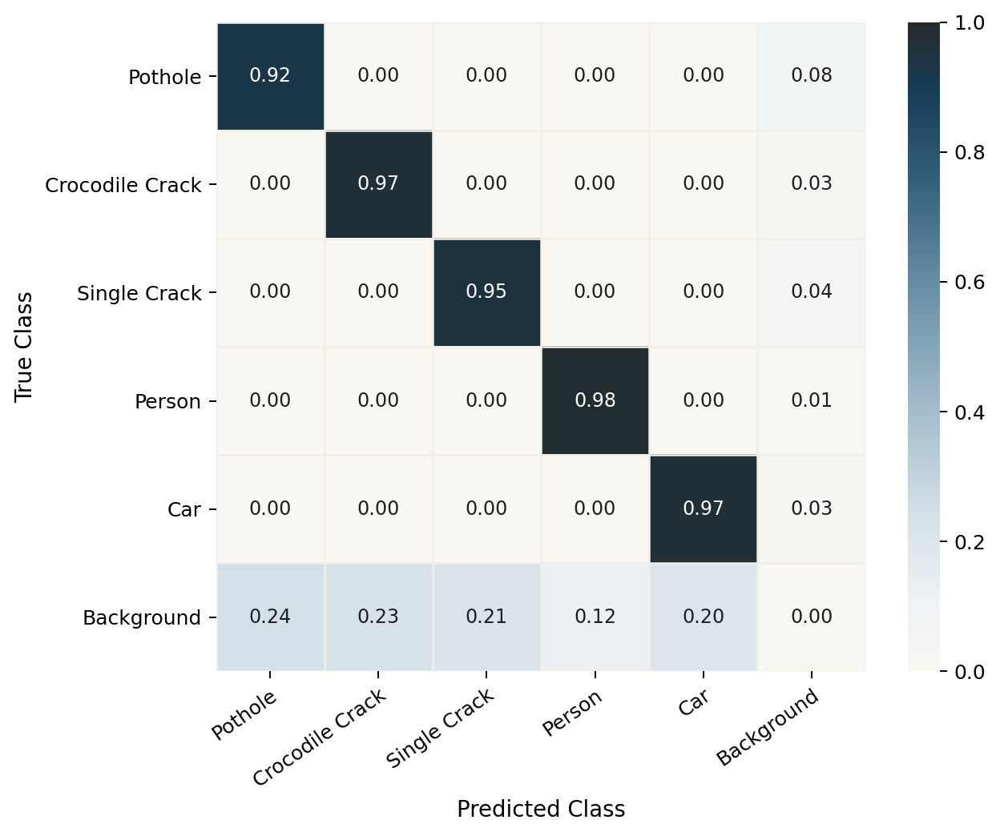

<p>
  <h1>
    A Digital Twin Framework for Traffic-Aware UAV Pavement Monitoring without Lane Closure
  </h1>
</p>

Yamil Uchani, Grace Abigail Luna Verdueta, Mauricio Figueroa, and Edwin Salcedo

[](https://arxiv.org/abs/2606.20742)
[](https://arxiv.org/pdf/2606.20742)
[](unity/)
[](models/model_finetuned.pt)
[](https://drive.google.com/drive/folders/1bfLm6uia9jM-xPxxl2PxLrq3OVG0Z8TZ?usp=sharing)
[](https://github.com/EdwinTSalcedo/RDMO-DigitalTwin)

<p align="center">
  
</p>

## Menu

- [1. Introduction](#1-introduction)
- [2. Quick Start](#2-quick-start)
- [3. Data](#3-data)
- [4. Perception Model](#4-perception-model)
- [5. Recovery Strategy Experiments](#5-recovery-strategy-experiments)
- [6. Test Automator](#6-test-automator)
- [7. Results](#7-results)
- [8. System Hardware Requirements](#8-system-hardware-requirements)
- [9. Related Resources](#9-related-resources)
- [10. Acknowledgements](#10-acknowledgements)
- [11. Cite Our Work](#11-cite-our-work)
- [12. Licence](#12-licence)

## 1. Introduction

This repository contains the Unity digital twin simulator and Python inference server for UAV-based pavement monitoring without lane closure. The simulator provides a controlled environment for testing how an autonomous UAV inspects road segments when vehicles and pedestrians temporarily occlude the road surface.

The framework integrates:

- a Unity urban-road environment with dynamic vehicles and pedestrians;
- procedurally generated road defects, including Single Crack, Crocodile Crack, and Pothole;
- autonomous UAV navigation over road segments using Unity NavMesh;
- adaptive recovery strategies for occluded inspection regions;
- a shared-backbone multitask YOLOv8n perception model for road defects, people, and cars;
- a batch experiment automator for repeatable UAV recovery-strategy evaluation.

At a high level, the runtime workflow is:

```text
Unity digital twin
  -> UAV route planning and segment inspection
  -> traffic-aware visibility and recovery logic
  -> optional Python perception server
  -> model-assisted detections and experiment logs
```

```text
RDMO-DigitalTwin/
|-- README.md
|-- assets/
|   `-- images/                # Paper figures used in this README
|-- docs/
|   |-- paper.pdf              # Local paper PDF/reference copy
|   |-- MODEL_CARD.md          # Historical model notes
|   |-- DEPLOYMENT.md          # Historical deployment notes
|   `-- LOG.md                 # Historical development notes
|-- models/
|   |-- model_base.pt          # Baseline checkpoint
|   `-- model_finetuned.pt     # Deployed checkpoint for the simulator server
|-- data/                      # Downloaded datasets; ignored by Git
|-- results/                   # UAV recovery-strategy results and CSV exports
`-- unity/
    |-- Assets/
    |-- Packages/
    `-- ProjectSettings/
```

## 2. Quick Start

### 1. Open the Unity project

The Unity project root is:

```text
unity/
```

Open that folder in Unity Hub. The project was last configured with:

```text
Unity 6000.2.14f1
```

The main scenes are registered in `unity/ProjectSettings/EditorBuildSettings.asset`.

| Scene | Purpose |
| --- | --- |
| `Assets/Scenes/Mode_Menu.unity` | Entry scene for launching simulator modes. |
| `Assets/Scenes/Mode_Load.unity` | Loading and initialisation scene. |
| `Assets/Scenes/Mode_Model.unity` | Interactive visual simulation. |
| `Assets/Scenes/Mode_Data.unity` | Batch experiment and data mode. |
| `Assets/Scenes/Mode_Capture.unity` | Dataset capture mode. |

### 2. Create the Python environment

From the repository root:

```bash
python3 -m venv .venv
source .venv/bin/activate
python -m pip install --upgrade pip
python -m pip install torch torchvision ultralytics fastapi "uvicorn[standard]" python-multipart opencv-python numpy
```

### 3. Start the model server

The deployed checkpoint is:

```text
models/model_finetuned.pt
```

Start the server from the repository root:

```bash
source .venv/bin/activate
python unity/Assets/Scripts/AI/api_model_pt.py
```

The legacy launcher is also supported:

```bash
python unity/Assets/Scripts/AI/api_baches.py
```

Both commands serve the inference API at:

```text
http://127.0.0.1:5000
```

Health check:

```bash
curl http://127.0.0.1:5000/health
```

Prediction test:

```bash
curl -X POST \
  -F "file=@/absolute/path/to/test_image.png" \
  http://127.0.0.1:5000/predict
```

Example response:

```json
[
  {
    "clase": "Pothole",
    "det_conf": 0.91,
    "cls_conf": 0.88,
    "caja": [120, 95, 260, 180]
  }
]
```

Annotated server outputs are written to:

```text
unity/Assets/Scripts/AI/Detecciones_model_pt/
```

To test a different checkpoint, set `RDMO_MODEL_PATH`:

```bash
RDMO_MODEL_PATH=/absolute/path/to/other_model.pt \
python unity/Assets/Scripts/AI/api_model_pt.py
```

### 4. Run the simulator

1. Start the Python server if model-assisted detections are required.
2. Open `unity/` in Unity Hub.
3. Open `Assets/Scenes/Mode_Menu.unity`.
4. Press Play.
5. Select the desired simulator mode from the menu.

For direct testing, open one of the scene files listed above and press Play.

## 3. Data

The datasets described in the paper are available from [Google Drive](https://drive.google.com/drive/folders/1bfLm6uia9jM-xPxxl2PxLrq3OVG0Z8TZ?usp=sharing). Download the datasets and extract them under the repository root so the expected layout is:

```text
data/
|-- merged_dataset/
|   |-- data.yaml
|   |-- train/
|   |-- val/
|   `-- test/
|-- augmented_dataset/
|   |-- dataset.yaml
|   |-- train/
|   |-- valid/
|   `-- test/
`-- synthetic_dataset/
    |-- dataset.yaml
    |-- train/
    |-- valid/
    `-- test/
```

### Dataset Files

| Folder | Paper name | Purpose | Paper statistics |
| --- | --- | --- | --- |
| `merged_dataset` | Merged Dataset | Normalised five-class dataset assembled from the source road-damage and UAV traffic datasets before balancing. | 18,741 images, including 17,938 annotated images and 803 backgrounds; 71,034 boxes. |
| `augmented_dataset` | Balanced Dataset | Class-balanced and augmented real-image dataset used for the first model-development stage. | 46,175 images, including 42,755 annotated images and 3,420 backgrounds; 120,769 boxes. |
| `synthetic_dataset` | Synthetic Dataset | Unity-captured target-domain dataset used for simulator-domain fine-tuning and evaluation. | 2,235 images; 25,943 boxes. |

### Simulator data

The Unity digital twin generates UAV-view road scenes with:

<p align="center">
  
  
  
</p>

- road-surface defects: `Single Crack`, `Crocodile Crack`, and `Pothole`;
- traffic agents: `Person` and `Car`;
- configurable traffic densities and UAV altitudes;
- road-segment inspection targets selected manually or by the experiment automator.

<p align="center">
  
  
  
</p>

### Model-development data

For the perception model, the paper normalises road-damage annotations from multiple datasets into a common five-class taxonomy:

| Final class | Role in the simulator |
| --- | --- |
| `Crocodile Crack` | Road-defect subtype. |
| `Single Crack` | Road-defect subtype. |
| `Pothole` | Road-defect subtype. |
| `Person` | Dynamic occluding traffic agent. |
| `Car` | Dynamic occluding traffic agent. |

The balanced training dataset reported in the paper contains 46,175 images and 120,769 annotated boxes. A synthetic simulator dataset is then collected from the digital twin and used for domain fine-tuning, with 2,235 images and 25,943 annotated boxes.

The full raw training datasets are not required to run the deployed simulator. They are required only for researchers who want to reproduce or extend the perception-model training pipeline.

### Class Order

All dataset YAML files use the same five-class mapping:

| ID | Class |
| ---: | --- |
| 0 | `Crocodile Crack` |
| 1 | `Single Crack` |
| 2 | `Pothole` |
| 3 | `Person` |
| 4 | `Car` |

The Unity capture exporter has been aligned with this mapping, so newly captured synthetic samples and the provided synthetic dataset use the same class IDs as the real-image datasets.

### Reproducibility Notes

- The Google Drive folder is the canonical distribution point for the paper datasets.
- Keep the downloaded folders under `data/`; this path is intentionally ignored by Git.
- Use `data/augmented_dataset/dataset.yaml` for the balanced real-image stage.
- Use `data/synthetic_dataset/dataset.yaml` for the simulator-domain stage.
- If you redistribute derived datasets, cite the arXiv preprint and the original public datasets listed in the paper.

## 4. Perception Model

<p align="center">
  
</p>

The deployed model is a shared-backbone multitask YOLOv8n model. It is not a standard five-class YOLO detector. Instead, it performs coarse detection first and then classifies road-defect subtypes from ROI-aligned features.

```text
Input image
  -> YOLOv8n backbone and neck
  -> shared feature maps
      |-- detection head
      |     Road-defect-general / Person / Car
      `-- ROIAlign on road-defect boxes
            Crocodile Crack / Single Crack / Pothole
```

The final simulator-facing classes are:

| ID | Class |
| ---: | --- |
| 0 | `Crocodile Crack` |
| 1 | `Single Crack` |
| 2 | `Pothole` |
| 3 | `Person` |
| 4 | `Car` |

The arXiv preprint reports that the full simulator perception pipeline achieved 99.26% overall accuracy across the five classes on the simulator test set. The currently deployed checkpoint for this repository is `models/model_finetuned.pt`, loaded by default through the Python server.

<p align="center">
  
</p>

## 5. Recovery Strategy Experiments

The digital twin evaluates UAV inspection behaviour under occlusion. At each time step, it tracks the road segments, dynamic traffic agents, UAV state, inspection memory, and available recovery policies. When the target road segment becomes insufficiently visible, the simulator can trigger a recovery strategy.

| ID | Strategy | Action |
| ---: | --- | --- |
| 1 | `Baseline` | Follow the planned inspection route without an explicit recovery action. |
| 2 | `Hover` | Wait briefly over the target segment so temporary occlusions can clear. |
| 3 | `Micro` | Apply a small local repositioning movement to improve visibility. |
| 4 | `Skip` | Skip the occluded segment and revisit it later in the mission. |

The experiment protocol combines:

| Factor | Levels |
| --- | --- |
| Traffic density | `Low`, `Medium`, `High` |
| UAV altitude | `Low = 6 m`, `Medium = 10 m`, `High = 15 m` |
| Recovery strategy | `Baseline`, `Hover`, `Micro`, `Skip` |

The full batch covers:

```text
3 traffic levels x 3 altitude levels x 4 strategies = 36 episodes
```

The arXiv preprint reports that flight altitude strongly affects inspection coverage and that adaptive recovery improves performance under occlusion. In the reported experiments, hover-and-recheck provides the most consistent coverage under medium and high traffic conditions, while skip-and-revisit is most effective in low-traffic scenarios.

## 6. Test Automator

The batch experiment automator is attached to the `DigitalTwinManager` object in:

```text
unity/Assets/Scenes/Mode_Data.unity
```

Recommended workflow:

1. Open `Assets/Scenes/Mode_Data.unity`.
2. Select the inactive `DigitalTwinManager` object in the Hierarchy.
3. Find the `DigitalTwin.ExperimentAutomator` component in the Inspector.
4. Configure the experiment fields.
5. Press Play.
6. From the component context menu, run `Start Experiment Batch`.

Useful automator fields:

| Field | Recommended value |
| --- | --- |
| `segmentsPerEpisode` | Use `1` for a smoke test or `20` for the full protocol. |
| `startFromEpisode` | Use `0` to start from the beginning. |
| `initialTrafficLevel` | `0=Low`, `1=Medium`, `2=High`. |
| `initialAltitudeLevel` | `0=Low`, `1=Medium`, `2=High`. |
| `initialNavigationMode` | `1=Baseline`, `2=Hover`, `3=Micro`, `4=Skip`. |
| `recordingMode` | Disabled for the full 36-episode sweep; enabled for selected recording runs. |

The automator disables `PythonInferenceClient` during controlled batch execution so recovery-strategy comparisons remain deterministic and memory-efficient. Use the Python server for model-assisted interactive runs and dataset capture workflows.

Batch outputs are written under:

```text
unity/Assets/DigitalTwin_Logs/
```

Important files:

| File | Contents |
| --- | --- |
| `Progress_Results.csv` | Progress rows written while the batch runs. |
| `All_Streets_Results.csv` | Full experiment summary. |
| `Paper_Table_Results.csv` | Compact coverage, time, energy, and recovery table. |
| `Ep*_Seg*_*.csv` | Per-segment details. |
| `Episode_*_*.csv` | Per-episode segment details. |

## 7. Results

The `results/` folder contains the UAV recovery-strategy results used for sharing and post-processing.

| File | Contents |
| --- | --- |
| `results/results.xlsx` | Original Excel workbook containing the UAV testing results. |
| `results/uav_segment_results.csv` | Clean CSV export of the detailed per-segment table. It contains 720 rows, corresponding to 36 experiment configurations x 20 segment-level entries. |
| `results/uav_summary_results.csv` | Clean CSV export of the summary table. It contains 36 rows, one for each traffic-altitude-strategy configuration. |
| `results/uav_results.csv` | Full-sheet CSV export that preserves the original side-by-side workbook layout. |

For most reproducibility use cases, prefer `uav_segment_results.csv` for detailed analysis and `uav_summary_results.csv` for recreating paper-style tables. The summary CSV reports coverage, recovery, energy, and mission time as mean +/- standard deviation.

## 8. System Hardware Requirements

### Simulator

- Unity `6000.2.14f1`.
- A desktop or laptop capable of running a Unity 3D project with dynamic agents and NavMesh navigation.
- A discrete GPU is recommended for smoother interactive runs.

### Python inference server

- Python 3.10 or newer.
- PyTorch, TorchVision, Ultralytics, FastAPI, Uvicorn, OpenCV, and NumPy.
- CUDA is recommended for real-time inference, but CPU execution can be used for debugging.

The experiments reported in the paper were run on a desktop with an AMD Ryzen 5 5600G CPU, NVIDIA GeForce GTX 1050 Ti GPU with 4 GB VRAM, and 16 GB RAM. Detector FPS comparisons were measured on an NVIDIA T4 GPU.

## 9. Related Resources

- arXiv preprint: <https://arxiv.org/abs/2606.20742>
- arXiv PDF: <https://arxiv.org/pdf/2606.20742>
- Dataset folder: <https://drive.google.com/drive/folders/1bfLm6uia9jM-xPxxl2PxLrq3OVG0Z8TZ?usp=sharing>
- `results/results.xlsx`: original UAV testing workbook.
- `results/uav_segment_results.csv` and `results/uav_summary_results.csv`: CSV exports for sharing and analysis.
- `docs/paper.pdf`: local paper PDF/reference copy.
- `docs/MODEL_CARD.md`: historical notes about the multitask model.
- `docs/DEPLOYMENT.md`: historical deployment notes from earlier repository layouts.
- `models/model_finetuned.pt`: current deployed checkpoint for the Python server.
- `models/model_base.pt`: baseline checkpoint retained for comparison.

The paper also discusses the public road-damage and UAV-view traffic datasets used to construct the training data, including HighRPD, RDD2022, UAV-PDD2023, UAPD, PothRGBD, and UAV car/pedestrian datasets.

## 10. Acknowledgements

This project builds on Unity, Blender, PyTorch, TorchVision, Ultralytics YOLO, Albumentations, FastAPI, and OpenCV. The perception model and evaluation protocol also depend on public pavement-distress and UAV-view traffic datasets cited in the arXiv preprint.

## 11. Cite Our Work

If you use this simulator, model, or experiment automator in your research, please cite the associated paper:

```bibtex
@misc{uchani2026digitaltwinframework,
  title         = {A Digital Twin Framework for Traffic-Aware UAV Pavement Monitoring without Lane Closure},
  author        = {Uchani, Yamil and Verdueta, Grace Abigail Luna and Figueroa, Mauricio and Salcedo, Edwin},
  year          = {2026},
  eprint        = {2606.20742},
  archivePrefix = {arXiv},
  primaryClass  = {cs.RO},
  doi           = {10.48550/arXiv.2606.20742},
  url           = {https://arxiv.org/abs/2606.20742}
}
```

## 12. Licence

This repository is released under the [MIT License](LICENSE.md).
